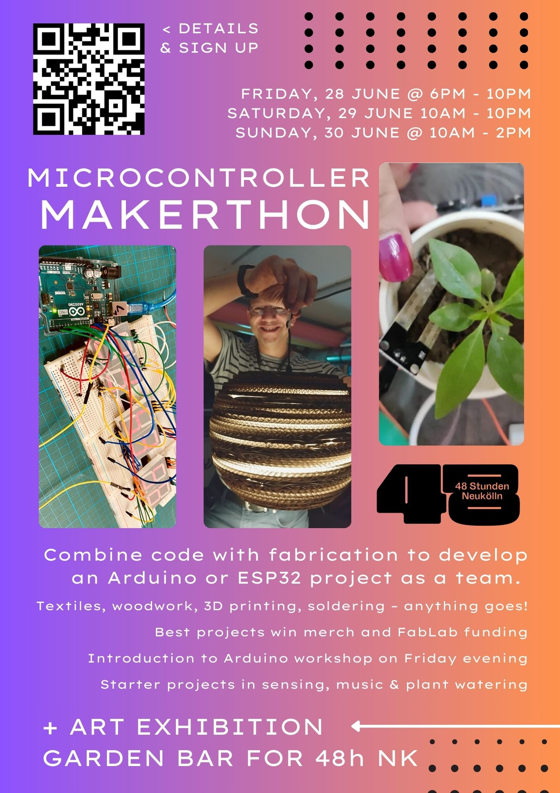

This repo is to support and document the Microcontroller Makerthon happening 28 29 30 June 2024 at FabLabNK.

## Important info
- No drinks anywhere but the sofa area and no alcohol in the lab
- Use a hub where possible for connecting Arduinos to lab PC's: don't burn our USB ports :)
- Our goal is proof-of-concept prototypes: not finished products!
- Reduced price drinks tokens from bar
- Bring extra equipment - we don't have everything!
	- USB cables (micro, C, mini), breadboards, etc (label your stuff)
- Share knowledge/inspiration in the #makerthon Slack channel
- Share your code at the end by making a pull request to this repo in a folder with your team name i.e `team_superamazing`
- If you're not a 42 student use bathrooms outside or at workish

## Schedule

### Fri 18-22
- 18:00 Kick-off
	- About the Makerthon
	- Introduction round: getting to know each other & the support team
- 18:30 Two options/groups:
	1. Starter project: introduction to sensing
	2. Brainstorming and idea generation
- 20:30 Donuts and decisions: choosing teams and projects
- 21:00 The real making can begin :)

### Sat 10-22
- 10:00 Lab opens
- 13:30 Luiz and Martin: Drone research presentation
- 14:00 Get-together 1: Coffee + discuss project progress
- 20:15 Diana and Hannes: Stroboscope presentation (TBC)
- 20:30 Get-together 2: Foodshared late dinner + discuss project progress
- 22:00 Official close (or make into the night!)

### Sun 10-14
- 10:00 Lab opens: finalising of projects
- 13:30 Submit your project: pitches and prizes
- 14:00 Buffet lunch
- 15:00 Official event close

## Teams

- Max 4 people per team, ideally with mix of abilities
- If you already know who you want to work with, let us know!
- Teams can work on the same project basis (encouraged!)

## Suggested Projects

All projects are just jumping-off points that we already have some equipment for - if you have your own ideas, all the better 💡

### 1: Introduction to Arduino and Sensors

- We will kick-off the makerthon with [this project](https://www.youtube.com/watch?v=q9UCSynDEw8) to learn and refresh some basics
- Sensors are the core of most microcontroller projects
	- practice with four of them to measure temperature, humidity, distance, motion and orientation
- Use what you learn as the basis for your Makerthon project

### 2: Hack the Duck

- We have created 3D-printed hollowed out duck-parts kits for you to experiment with :)
- Take a kit and add light, sound, motion or whatever you can imagine
- Go from hackathon to quackathon in 48 hours

### 3: Automatic Plant Watering

- Help save the FabLab plants from our human incompetence by using soil moisture sensors to water a plant when it needs it most
- Build your own no-pump water dispensing system. Starting point [here](https://www.instructables.com/No-Pump-Automatic-Watering/)
- Extend the project with a web-server to monitor watering stats remotely. Jack already has an ESP32 potential starting point for this [here](https://github.com/jackoske/wifi-access-point-ESP)

### 4: Motors and Platforms

- Assemble a [joystick-controlled maze](https://www.tinkercad.com/projects/Simple-Arduino-Maze-Robot-for-Project-Based-Learni]) using 3D printed parts and two servo motors
- Adapt the project with a gyroscope sensor to make a self-levelling platform
- Find your own use-case: self-levelling platform technology is used in camera stabilisation, hoverboards, drones and earthquake-proof buildings
- See [example code from Hannes]([./4_Motors_and_Platforms/hannes_self_levelling_platform.ino]), who built such a platform with lego last year

### 5: 8-Bit Music Machines

- Hack and modify one of our Arduino-based projects from SynthLab: a [drum player](https://github.com/wgd-modular/utf-8-samplified), [dual oscillator](https://github.com/Blinken-Lights/ASCII/tree/main/8%20Bit%20Waves) or [clock sequencer](https://github.com/fablabnk/HagiwoClockMultiDivide)
- Modify our [jumping off point](https://github.com/fablabnk/ArduinoDrumMachine) and find your own sound
- Explore new ways to control it. Use sensors? Fabricate a case? Place it inside a duck? :)

## Support Team : Who's Around When?

- FabLab managers Graham or Zandra will be around during opening hours
- The full team is: Graham, Zandra, Jack, Laurent, Pavlos and Olimpiya
- The person(s) in charge will be wearing the FabLab admin badge

### Shift Schedule

- Fri 18-20: Graham
- Fri 20-22: Zandra / Laurent
- Sat 10-12: Graham / Laurent
- Sat 12-14: Graham / Olimpiya
- Sat 14-16: Zandra / Jack
- Sat 16-18: Zandra / Jack
- Sat 18-20: Graham / Pavlos
- Sat 20-22: Graham / Pavlos
- Sun 10-13: Graham
- Sun 13-15: Zandra / Olimpiya

## Microcontroller Quickstart

For a quick guide of what to do when you can't upload to Arduino's or ESP32's, look [here](https://github.com/fablabnk/MicrocontrollerQuickstart)

## Prizes

Will be awarded at 2pm on Sunday

### Individual (Merch)

During your pitch, you may nominate one member of your team for any of the following prizes and give a reason:

- **Dedication prize**: most hours logged or perseverence in solving a problem (wins a mug)
- **Progression prize**: most learned during the Makerthon (wins a t-shirt)
- **Creativity prize**: most creative idea or contribution (wins a hoodie)

The winners will be decided by public vote

### Grand Group Prize

- Up to 250 euros from the FabLab budget to develop the project further / build a prototype
- Production of a custom printed circuit board (if appropriate)
- Chance to run the project as a FabLab workshop for others to build

The winning group will be decided by FabLab managers Zandra and Graham
